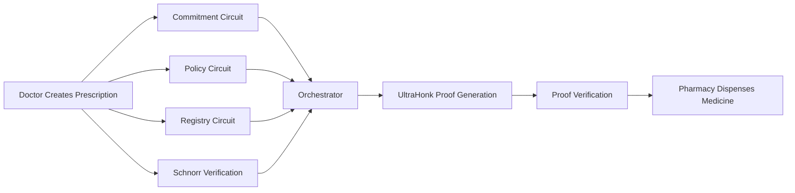

# zk-ePrescription

*A Privacy-Preserving Electronic Prescription Framework using Zero-Knowledge Proofs*

**Research Prototype • Noir • UltraHonk • Poseidon2 • BabyJubJub • Merkle Trees**

---

## Abstract

Healthcare systems increasingly rely on Electronic Health Records (EHRs) and digital prescriptions to improve accessibility, interoperability, and patient care. However, conventional e-Prescription systems require patients to disclose sensitive medical information—including prescription contents, prescribing doctors, and medication details—to pharmacies and other intermediaries during the redemption process. This creates significant privacy concerns and increases the attack surface for unauthorized access to personal health information.

**zk-ePrescription** is a research prototype that explores how Zero-Knowledge Proofs (ZKPs) can enable privacy-preserving prescription verification without revealing sensitive prescription data. Instead of exposing the complete prescription, the protocol allows a patient to generate a cryptographic proof demonstrating that:

- the prescription was issued by an authorized doctor,
- the prescription satisfies predefined policy constraints,
- the doctor's signature is valid,
- the prescription has not expired,
- the redemption threshold has not been exceeded, and
- the public outputs required for verification are computed consistently.

The current implementation is built using the **Noir** programming language and the **UltraHonk** proving system. The protocol is composed of modular circuits responsible for commitment generation, policy evaluation, registry verification, digital signature verification, and orchestration into a single enforcement circuit. Supporting cryptographic primitives include **Poseidon2** hash functions, **BabyJubJub** elliptic-curve signatures, and **Merkle Trees** for doctor registry membership proofs.

This repository represents the reference Noir implementation of the protocol. Each circuit is independently validated using automated positive and negative regression test suites before being integrated into the final orchestrator. Future work includes an equivalent Circom implementation, recursive proof composition, Ethereum verifier integration, and support for dynamic policy and registry updates.


---

# Implementation Status

The current implementation represents **Version 1.0** of the zk-ePrescription research prototype.

The primary objective of Version 1 is to demonstrate the feasibility of privacy-preserving electronic prescription verification using modular Zero-Knowledge circuits. The repository focuses on protocol correctness, modularity, and comprehensive circuit validation rather than production deployment.

## Current Status

| Component | Status | Description |
|-----------|:------:|-------------|
| Merkle Library | ✅ Complete | Generic Poseidon2-based Merkle tree library with parameterized verification circuits and regression test suites. |
| Commitment Circuit | ✅ Complete | Computes cryptographic commitments binding prescription information. |
| Policy Circuit | ✅ Complete | Evaluates prescription expiry and quantity threshold constraints. |
| Registry Circuit | ✅ Complete | Verifies doctor authorization using Merkle membership proofs. |
| Schnorr Verification | ✅ Complete | Verifies BabyJubJub EdDSA signatures over prescription commitments. |
| Orchestrator Circuit | ✅ Complete | Integrates all protocol components into a single enforcement circuit. |
| UltraHonk Integration | ✅ Complete | End-to-end witness generation, proving, and verification using Barretenberg. |
| Automated Validation | ✅ Complete | Positive and negative regression suites for all major protocol components. |
| Documentation | 🚧 In Progress | Repository documentation, architecture guides, and protocol specifications are being finalized. |
| Circom Implementation | ⏳ Planned | A functionally equivalent Circom implementation will be developed for comparison with the Noir reference implementation. |

---

# Implemented Components

The protocol is organized as a collection of reusable cryptographic modules, each responsible for enforcing a single security property.

| Module | Responsibility |
|---------|----------------|
| **Common Library** | Shared Poseidon2 hash primitives used throughout the protocol. |
| **Merkle Library** | Generic Merkle tree construction and membership verification. |
| **Commitment** | Generates cryptographic commitments for prescriptions. |
| **Policy** | Evaluates prescription validity against policy constraints. |
| **Registry** | Verifies doctor membership in the authorized registry. |
| **Schnorr** | Verifies BabyJubJub EdDSA signatures. |
| **Outputs** | Computes replay-protection nullifiers and public outputs. |
| **Orchestrator** | Combines all protocol modules and enforces correctness through circuit constraints. |

The modular architecture allows each component to be independently validated and reused while maintaining a single enforcement point inside the Orchestrator.


---

# Why Zero-Knowledge e-Prescriptions?

Electronic Prescription (e-Prescription) systems have become an essential component of modern digital healthcare, enabling physicians to issue prescriptions electronically while improving accessibility, reducing paperwork, and supporting interoperable Electronic Health Record (EHR) systems. National healthcare initiatives such as India's Ayushman Bharat Digital Mission (ABDM) further promote standardized digital health records and prescription management across healthcare providers.

Despite these advancements, the prescription redemption process still requires patients to disclose substantial amounts of sensitive medical information to pharmacies and other intermediaries. During verification, pharmacies typically gain access to information including:

- Patient identity
- Prescription identifier
- Prescribing doctor
- Medicine details
- Treatment information
- Prescription validity

In many situations, the pharmacy only needs to answer a much simpler question:

> **"Is this prescription valid and authorized for dispensing?"**

The complete prescription contents are often unnecessary for performing this verification, yet they are routinely disclosed during the redemption process. This creates avoidable privacy risks and increases the exposure of sensitive healthcare data.

## Design Goal

The primary goal of **zk-ePrescription** is to replace **data disclosure** with **cryptographic proof**.

Rather than revealing the prescription itself, the protocol allows a patient to prove that a prescription satisfies the required verification conditions while minimizing the information disclosed during redemption.

Conceptually, the verifier only needs assurance that:

- the prescription was issued by an authorized doctor;
- the doctor's signature is valid;
- the prescription satisfies policy constraints (such as expiry and redemption threshold);
- the prescription has not already been redeemed using the same nullifier; and
- the proof was generated from authentic prescription data.

Instead of transmitting sensitive prescription contents, the patient presents a Zero-Knowledge Proof demonstrating that these conditions hold.

## Design Principles

The protocol is guided by the following principles:

- **Privacy by Design** — minimize disclosure of sensitive medical information during prescription verification.
- **Cryptographic Integrity** — ensure that prescriptions cannot be modified without invalidating the proof.
- **Modularity** — implement independent circuits for commitments, policy evaluation, registry verification, signature verification, and orchestration.
- **Replay Protection** — prevent multiple redemptions of the same prescription through cryptographic nullifiers.
- **Verifiable Authorization** — allow pharmacies to verify that prescriptions originate from authorized doctors without exposing unnecessary registry information.
- **Extensibility** — design reusable components that can support future protocol enhancements, additional policy rules, and alternative proving systems.

The remainder of this repository presents the architecture, implementation, validation, and evaluation of this modular Zero-Knowledge e-Prescription framework.

---

# System Architecture

The zk-ePrescription protocol is designed as a collection of modular Zero-Knowledge circuits that collectively verify the authenticity, authorization, and policy compliance of an electronic prescription without revealing sensitive medical information.

Each circuit is responsible for enforcing a single security property. The final **Orchestrator** circuit integrates these components into a single proof that can be verified by an external verifier (e.g., a pharmacy).

## High-Level Protocol Flow



---

## End-to-End Workflow

The protocol proceeds through the following stages:

### Phase 1 — Commitment

The prescription contents are cryptographically bound using a Poseidon2 commitment.

The commitment uniquely represents the prescription while preventing undetected modification of its contents.

**Outputs**

- Commitment

---

### Phase 2 — Policy Evaluation

The policy circuit evaluates prescription constraints such as:

- Prescription expiry
- Redemption threshold

The circuit determines whether the prescription satisfies all configured policy requirements.

**Outputs**

- Quantity validity
- Expiry validity

---

### Phase 3 — Registry Verification

The doctor's identity is verified against an authenticated Merkle registry.

A Merkle authentication path proves that the doctor's public key belongs to the authorized registry without revealing unrelated registry entries.

**Outputs**

- Registry membership validity

---

### Phase 4 — Schnorr Signature Verification

The doctor's BabyJubJub EdDSA signature is verified over the prescription commitment.

This guarantees that the prescription originated from the claimed authorized doctor.

**Outputs**

- Signature validity

---

### Phase 5 — Orchestrator

The Orchestrator is the final enforcement circuit.

It combines the outputs of all previous modules and enforces the following conditions:

- Policy constraints must hold.
- Registry membership must be valid.
- Signature verification must succeed.

If any verification fails, the circuit becomes unsatisfiable and no proof can be generated.

When all constraints are satisfied, the circuit computes:

- Commitment
- Replay-protection Nullifier

These become the public outputs of the protocol.

---

## Component Architecture

| Component | Responsibility | Output |
|-----------|----------------|--------|
| Commitment | Bind prescription contents | Commitment |
| Policy | Validate expiry and redemption policy | Policy flags |
| Registry | Verify doctor authorization | Registry validity |
| Schnorr | Verify doctor's digital signature | Signature validity |
| Outputs | Compute replay-protection nullifier | Commitment, Nullifier |
| Orchestrator | Enforce protocol correctness | Final public outputs |

---

## Design Philosophy

The protocol follows a modular architecture in which each circuit is responsible for enforcing a single security property.

This separation provides several advantages:

- Individual circuits can be developed and validated independently.
- Components can be reused across future protocols.
- Security analysis is simplified because each module has a well-defined responsibility.
- The Orchestrator serves as the single enforcement point, ensuring that proofs are generated only when every protocol constraint is satisfied.

This modular design also facilitates future extensions such as recursive proof composition, dynamic policy evaluation, larger authorization registries, and alternative proving systems without requiring fundamental changes to the protocol architecture.

---

# Repository Structure

The repository is organized into modular components to separate reusable cryptographic libraries, protocol circuits, validation infrastructure, tooling, and documentation.

```text
zk-ePrescription/
│
├── docs/                         # Architecture, validation, and security documentation
├── benchmarks/                   # Performance measurements and benchmark reports
│
├── noir/                         # Reference Noir implementation
│   ├── common/                   # Shared Poseidon2 hash primitives
│   ├── merkle/                   # Generic Merkle tree library
│   ├── phase1_commitment/         # Commitment circuit
│   ├── phase2_policy/             # Policy evaluation circuit
│   ├── phase3_registry/           # Doctor registry verification circuit
│   ├── phase4_orchestrator/       # Final enforcement circuit
│   │
│   ├── tools/                    # Development utilities
│   ├── examples/                 # Example Noir programs
│   ├── archive/                  # Historical experiments
│   │
│   ├── tests/                    # End-to-end regression suites
│   ├── scripts/                  # Automation scripts
│   ├── benchmarks/               # Circuit benchmarking
│   └── Nargo.toml                # Noir workspace
│
├── README.md
└── .gitignore
```

## Directory Overview

The repository is divided into four major categories:

### Core Libraries

Reusable cryptographic primitives shared across multiple circuits.

- `common`
- `merkle`

### Protocol Circuits

The modular Zero-Knowledge circuits implementing the e-Prescription protocol.

- Phase 1 — Commitment
- Phase 2 — Policy
- Phase 3 — Registry
- Phase 4 — Orchestrator

### Development Infrastructure

Supporting utilities used during implementation and validation.

- Tools
- Examples
- Scripts
- Benchmarks

### Documentation

Technical documentation describing the architecture, validation methodology, and security analysis of the protocol.

---

# Protocol Pipeline

The zk-ePrescription protocol follows a modular verification pipeline in which each circuit enforces a specific security property. Rather than relying on a single monolithic circuit, the protocol composes multiple reusable cryptographic modules into a final enforcement circuit known as the **Orchestrator**.

During proof generation, the patient's private prescription data is processed through each stage of the pipeline. Every stage validates a different aspect of the prescription. Only if **all security checks succeed** can the Orchestrator produce a valid Zero-Knowledge Proof.

The verifier (e.g., a pharmacy) only verifies the final proof and the public outputs. The intermediate computations and private prescription information remain confidential.

---

## Phase 1 — Commitment Generation

The first stage binds the prescription contents into a single cryptographic commitment.

### Private Inputs

- Prescription ID
- Doctor ID
- Medicine Code

### Operation

The circuit computes a Poseidon2 commitment over the prescription fields.

```
commitment = Poseidon2(
    prescription_id,
    doctor_id,
    medicine_code
)
```

### Security Objective

- Prevent unauthorized modification of prescription contents.
- Produce a deterministic cryptographic representation of the prescription.

### Output

```
Commitment
```

---

## Phase 2 — Policy Evaluation

The second stage evaluates whether the prescription satisfies predefined dispensing policies.

### Private Inputs

- Quantity Threshold
- Redemption Index (Slot Index)
- Expiry Date
- Current Date

### Policy Checks

The circuit verifies:

- Redemption count has not exceeded the permitted threshold.
- Prescription has not expired.

```
Quantity Valid

slot_index < quantity_threshold

Expiry Valid

current_date ≤ expiry_date
```

### Security Objective

Ensure that expired prescriptions or prescriptions exceeding their redemption limits cannot generate valid proofs.

### Output

```
Quantity Valid
Expiry Valid
```

---

## Phase 3 — Registry Verification

The third stage proves that the prescribing doctor belongs to the authorized medical registry.

### Private Inputs

- Doctor ID
- Doctor Public Key
- Merkle Authentication Path

### Public Input

- Registry Root

### Operation

The circuit reconstructs the Merkle root using the supplied authentication path.

```
Leaf

↓

Hash

↓

Hash

↓

...

↓

Computed Root
```

The computed root is compared against the public registry root.

### Security Objective

Only doctors whose public keys are members of the authenticated registry can satisfy the circuit constraints.

### Output

```
Registry Valid
```

---

## Phase 4 — Signature Verification

The fourth stage authenticates the prescription using the doctor's digital signature.

### Private Inputs

- Signature Nonce (R)
- Signature Scalar (S)
- Doctor Public Key

### Input

- Commitment

### Operation

The circuit verifies a BabyJubJub EdDSA signature over the prescription commitment.

### Security Objective

Guarantee that the prescription was signed by the authorized doctor and has not been altered after signing.

### Output

```
Signature Valid
```

---

## Phase 5 — Orchestrator

The Orchestrator is the final enforcement circuit.

Rather than recomputing protocol logic independently, it composes the outputs of the previous modules and enforces all protocol constraints simultaneously.

The Orchestrator verifies that:

- Commitment computation completed successfully.
- Policy constraints are satisfied.
- Registry membership is valid.
- Digital signature verification succeeds.

If **any** verification fails, the circuit becomes **unsatisfiable**, preventing witness generation and proof construction.

### Final Outputs

Once all constraints are satisfied, the Orchestrator computes:

```
Commitment
Nullifier
```

The **Commitment** uniquely identifies the prescription, while the **Nullifier** provides replay protection by ensuring that the same prescription redemption cannot be accepted multiple times within the protocol.

---

## End-to-End Verification Flow

The complete verification process can be summarized as follows:

```text
Doctor
    │
    ▼
Issue Prescription
    │
    ▼
Commitment Generation
    │
    ▼
Policy Evaluation
    │
    ▼
Registry Verification
    │
    ▼
Signature Verification
    │
    ▼
Orchestrator
    │
    ▼
Generate UltraHonk Proof
    │
    ▼
Verifier (Pharmacy)
    │
    ▼
Verify Proof
    │
    ▼
Dispense Medicine
```

---

## Design Rationale

The protocol adopts a modular architecture instead of implementing all functionality within a single circuit.

This design provides several advantages:

- Independent development and validation of each circuit.
- Reusable cryptographic components across future protocols.
- Simplified debugging and security analysis.
- Separation of responsibilities between commitment, authorization, policy enforcement, and signature verification.
- A single enforcement point through the Orchestrator, ensuring that a proof can only be generated when every protocol requirement is satisfied.

This modular structure also enables future extensions, including recursive proof composition, dynamic policy rules, larger authorization registries, and alternative proving systems without redesigning the protocol from scratch.


---

# Circuit Architecture

The Noir implementation of **zk-ePrescription** is organized into a collection of reusable libraries and protocol-specific circuits. Each package is designed with a single responsibility, allowing components to be developed, tested, and validated independently before integration into the final Orchestrator.

The architecture follows a layered design:

```
Shared Cryptographic Libraries
            │
            ▼
   Protocol-Specific Circuits
            │
            ▼
     Orchestrator Circuit
            │
            ▼
     UltraHonk Proof System
```

Each circuit contributes one well-defined security property to the overall protocol.

---

## Shared Cryptographic Libraries

### `common`

The **common** package provides reusable cryptographic primitives shared across multiple circuits.

**Responsibilities**

- Poseidon2 hash functions
- Commitment hashing
- Registry leaf hashing
- Merkle node hashing
- Nullifier hashing
- Low-level cryptographic helper functions

**Used By**

- Commitment
- Registry
- Outputs
- Schnorr
- Orchestrator

---

### `merkle`

The **merkle** package implements a generic, reusable Merkle Tree library.

Unlike application-specific circuits, this package is designed to be reusable across multiple projects.

**Responsibilities**

- Merkle tree construction
- Authentication path representation
- Membership verification
- Parameterized tree depth
- Generic verification APIs

**Features**

- Generic authentication paths
- Poseidon2-based hashing
- Parameterized tree depth
- Positive regression tests
- Negative regression tests

---

## Protocol Circuits

### Phase 1 — Commitment Circuit

**Package**

```
phase1_commitment/
```

The Commitment circuit creates a cryptographic binding between the prescription data and its future proof.

**Private Inputs**

- Prescription ID
- Doctor ID
- Medicine Code

**Output**

```
Commitment
```

**Security Property**

Prevents unauthorized modification of prescription contents.

**Dependencies**

- `common`

---

### Phase 2 — Policy Circuit

**Package**

```
phase2_policy/
```

The Policy circuit evaluates dispensing rules associated with a prescription.

**Private Inputs**

- Quantity Threshold
- Slot Index
- Expiry Date
- Current Date

**Outputs**

```
Quantity Valid
Expiry Valid
```

**Security Property**

Ensures prescriptions satisfy policy requirements before proof generation.

**Dependencies**

None

---

### Phase 3 — Registry Circuit

**Package**

```
phase3_registry/
```

The Registry circuit proves that the prescribing doctor belongs to an authenticated registry.

The implementation uses a parameterized Merkle verifier allowing registry depth to be configured at compile time.

**Private Inputs**

- Doctor ID
- Doctor Public Key
- Authentication Path

**Public Input**

```
Registry Root
```

**Output**

```
Registry Valid
```

**Security Property**

Ensures only authorized doctors can generate valid proofs.

**Dependencies**

- `common`

---

### Phase 4 — Schnorr Verification Module

The Schnorr module verifies BabyJubJub EdDSA signatures over the prescription commitment.

Unlike the previous packages, this module is implemented as part of the Orchestrator because it is only required during final proof generation.

**Responsibilities**

- Verify BabyJubJub signatures
- Validate curve membership
- Compute Poseidon2 challenge
- Verify EdDSA equation

**Security Property**

Authenticates the prescribing doctor.

**Dependencies**

- `common`
- `bjj_core`

---

### Output Module

The Output module computes the final public values emitted by the protocol.

**Responsibilities**

- Compute replay-protection nullifier
- Assemble public outputs

**Outputs**

```
Commitment
Nullifier
```

**Security Property**

Provides deterministic replay protection through cryptographic nullifiers.

---

## Phase 4 — Orchestrator

**Package**

```
phase4_orchestrator/
```

The Orchestrator is the central enforcement circuit of the protocol.

Rather than reimplementing cryptographic primitives, it composes the reusable modules into a single constraint system.

The Orchestrator performs the following operations:

1. Compute prescription commitment.
2. Evaluate prescription policy.
3. Verify doctor registry membership.
4. Verify BabyJubJub signature.
5. Compute replay-protection nullifier.
6. Enforce all protocol constraints.

If any verification fails, the circuit becomes unsatisfiable and no proof can be generated.

**Public Outputs**

```
Commitment
Nullifier
```

---

## Circuit Dependency Graph

The dependency relationships between the protocol components are summarized below.

```text
                 common
                /      \
               /        \
          merkle      bjj_core
             │            │
             │            │
   phase3_registry     schnorr
             │            │
             └──────┬─────┘
                    │
      phase1_commitment
                    │
             phase2_policy
                    │
                    ▼
         phase4_orchestrator
                    │
                    ▼
             UltraHonk Backend
```

---

## Design Principles

The circuit architecture follows several guiding principles:

### Modularity

Each package is responsible for enforcing exactly one security property.

### Reusability

Cryptographic primitives are isolated within reusable libraries rather than duplicated across circuits.

### Separation of Concerns

Application logic is separated from generic cryptographic utilities, simplifying maintenance and future extensions.

### Independent Validation

Every major circuit is validated independently using automated positive and negative regression suites before integration into the final protocol.

### Single Enforcement Point

The Orchestrator serves as the only circuit responsible for enforcing all protocol constraints simultaneously, ensuring that proofs can only be generated when every verification stage succeeds.

---

# Validation & Testing

Ensuring the correctness and security of each circuit is a primary objective of this project. Rather than validating the protocol only after full integration, every circuit is independently verified before being incorporated into the final Orchestrator.

The validation methodology consists of:

- Compilation (`nargo check`)
- Witness generation (`nargo execute`)
- Proof generation (`bb prove`)
- Proof verification (`bb verify`)
- Positive regression testing
- Negative regression testing

Each protocol component includes dedicated regression suites that verify both expected functionality and resistance to malformed or adversarial inputs.

## Validation Summary

| Circuit | Positive Tests | Negative Tests | Status |
|----------|---------------:|---------------:|:------:|
| Merkle Library | 8 | 5 | ✅ Validated |
| Commitment Circuit | 3 | 4 | ✅ Validated |
| Policy Circuit | 3 | 3 | ✅ Validated |
| Registry Circuit | 5 | 6 | ✅ Validated |
| Orchestrator Circuit | 1 | 5 | ✅ Validated |

## Testing Strategy

The validation framework follows a consistent methodology across all protocol components.

### Positive Tests

Positive regression tests verify that valid witnesses:

- compile successfully,
- generate valid witnesses,
- produce UltraHonk proofs,
- verify successfully.

### Negative Tests

Negative regression tests ensure that invalid witnesses cannot satisfy circuit constraints.

Examples include:

- Invalid Merkle authentication paths
- Incorrect registry roots
- Unauthorized doctor keys
- Expired prescriptions
- Threshold violations
- Invalid signatures
- Tampered commitments

Any invalid witness is expected to fail during witness generation or constraint evaluation, preventing proof construction.

Detailed validation reports for each circuit are available under the `docs/validation/` directory.

---

# Security Properties

The zk-ePrescription protocol is designed to enforce multiple independent security guarantees through modular Zero-Knowledge circuits.

## Prescription Integrity

Prescription contents are cryptographically bound using Poseidon2 commitments, preventing undetected modification after issuance.

---

## Doctor Authorization

Only doctors whose public keys belong to the authenticated registry can satisfy the registry verification circuit.

---

## Signature Authentication

Every prescription commitment must be accompanied by a valid BabyJubJub EdDSA signature generated by the prescribing doctor.

---

## Policy Enforcement

The protocol enforces configurable prescription policies including:

- Expiration date validation
- Redemption threshold validation

Invalid prescriptions cannot generate valid proofs.

---

## Replay Protection

Replay attacks are mitigated through cryptographic nullifiers derived from:

- Patient secret
- Prescription commitment
- Redemption slot index

Each redemption produces a deterministic nullifier suitable for duplicate detection.

---

## Privacy Preservation

The verifier learns only the public outputs required for verification.

Sensitive prescription information remains private throughout the proving process.

---

A detailed security analysis is provided in:

```

docs/security/orchestrator-security-review.md

```
---

# Performance & Benchmarks

Performance evaluation is an ongoing component of the project.

The benchmarking framework measures:

- Witness generation time
- Proof generation time
- Verification time
- Peak memory consumption
- Proof size
- Verification key generation time

Benchmark scripts are available under:

```

benchmarks/

```

Current benchmark reports are generated using the UltraHonk proving backend through Barretenberg.

Future releases will include comprehensive benchmarking across multiple circuit sizes and comparisons with equivalent Circom implementations.


---

# Getting Started

## Prerequisites

Install the following tools:

- Noir (Nargo)
- Barretenberg (`bb`)
- Git

## Clone the Repository

```bash
git clone https://github.com/<your-username>/zk-ePrescription.git

cd zk-ePrescription/noir
```

## Compile the Workspace

```bash
nargo check --workspace
```

## Execute a Circuit

Example:

```bash
cd phase1_commitment

nargo execute
```

## Generate a Proof

```bash
bb prove \
    --scheme ultra_honk \
    -b target/phase1_commitment.json \
    -w target/phase1_commitment.gz \
    -o target
```

## Verify the Proof

```bash
bb write_vk \
    --scheme ultra_honk \
    -b target/phase1_commitment.json \
    -o target

bb verify \
    --scheme ultra_honk \
    -k target/vk \
    -p target/proof \
    -i target/public_inputs
```

## Running Regression Tests

Each circuit includes automated regression suites.

Example:

```bash
cd phase3_registry/tests/scripts

./run_positive_suite.sh

./run_negative_suite.sh
```

---

# Future Work / Roadmap

The current repository represents Version 1 of the zk-ePrescription research prototype.

Planned future developments include:

## Protocol Enhancements

- Dynamic Merkle tree depths
- Policy Merkle trees
- Doctor revocation support
- Prescription revocation support
- Multi-prescription aggregation

---

## Cryptographic Improvements

- Recursive proof composition
- Incremental proving
- Alternative proving systems
- Recursive verification

---

## Ecosystem Integration

- Ethereum verifier contracts
- Smart contract integration
- On-chain nullifier registry
- Wallet integration

---

## Additional Implementations

- Equivalent Circom implementation
- Cross-framework benchmarking
- Performance comparisons between Noir and Circom

---

## Research Directions

- Anonymous healthcare credentials
- Selective disclosure
- Recursive healthcare proofs
- Privacy-preserving digital identity integration

---

# References

The implementation and design of this project build upon the following technologies and research:

1. **Noir Language** — Domain-specific language for Zero-Knowledge circuits.
2. **Barretenberg** — UltraHonk proving backend developed by Aztec.
3. **UltraHonk** — Plonkish proving system used for proof generation.
4. **Poseidon2** — Hash function optimized for Zero-Knowledge proof systems.
5. **BabyJubJub** — Twisted Edwards elliptic curve used for EdDSA signatures.
6. **Merkle Trees** — Authenticated data structures for membership proofs.
7. **Electronic Health Records (EHRs)** and digital prescription systems.
8. Academic literature on Zero-Knowledge Proofs, privacy-preserving healthcare, and cryptographic authentication.

---

# License

This project is currently released for academic and research purposes.

Unless otherwise specified, all source code in this repository is licensed under the **MIT License**.

See the `LICENSE` file for complete licensing information.

---

# Acknowledgements

This project was developed as part of ongoing research into privacy-preserving healthcare systems and Zero-Knowledge Proofs.

The implementation builds upon the open-source ecosystem surrounding Noir, Barretenberg, and modern Zero-Knowledge proving systems.

The authors gratefully acknowledge the developers and researchers whose work on Zero-Knowledge cryptography, authenticated data structures, and privacy-preserving protocols has made this research possible.


