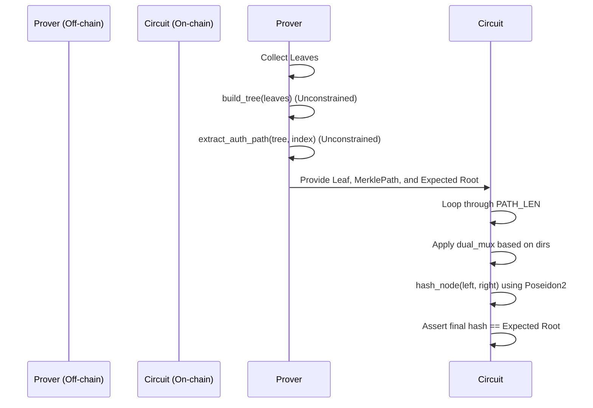

# Merkle Library Architecture

This document describes the structural and cryptographic architecture of the Noir Merkle library used in `zk-ePrescription`.

## Data Structures

### `MerklePath`
The standard structure defining a membership proof.
```rust
pub struct MerklePath<let PATH_LEN: u32> {
    pub hashes: [Field; PATH_LEN],
    pub dirs: [u8; PATH_LEN],
}
```
- `hashes`: The sibling hashes required to reconstruct the root.
- `dirs`: Directional indicators (`0` for left sibling, `1` for right sibling) at each level of the tree.

## Core Functions

### `build_tree()`
An `unconstrained` function that takes an array of leaves and iteratively hashes them to construct the entire Merkle tree. Being unconstrained ensures no circuit gates are consumed during this heavy operation.

### `extract_auth_path()`
An `unconstrained` function that traverses a generated tree to extract the `MerklePath` and the Merkle root for a specific `leaf_index`.

### `verify_path()`
The primary `constrained` verifier function. It sequentially hashes the starting `leaf` with the sibling hashes in `MerklePath`, using the `dirs` indicators to maintain correct left/right ordering. It asserts the final computed root matches `expected_root`.

## Cryptographic Primitives

### Poseidon2 Usage
The library relies on `Poseidon2` for hashing nodes. Specifically, it uses `merkle_node_hash(left, right)` from the `common::poseidon2_hash` module, which is heavily optimized for zero-knowledge proving backends like UltraHonk.

## Authentication Path Generation & Verifier Flow


