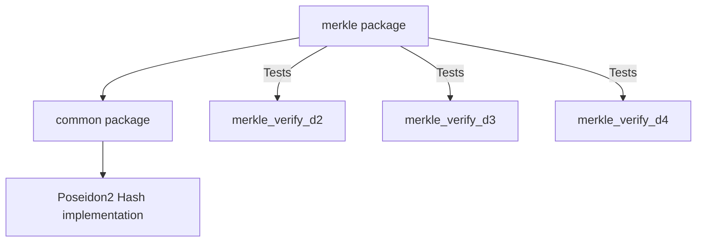

# Noir Merkle Library

## Purpose
The Merkle package is a modular, reusable library designed for the `zk-ePrescription` project. It provides off-chain (unconstrained) tree construction and on-chain (constrained) membership verification for Merkle trees in Noir.

## Architecture
The library cleanly decouples unconstrained off-chain helpers from the constrained on-chain verifier to maximize circuit efficiency:
- **Unconstrained Builder**: Efficiently computes the Merkle tree from raw leaves.
- **Unconstrained Extractor**: Generates authentication paths (`MerklePath`) and roots without consuming circuit gates.
- **Constrained Verifier**: Efficiently verifies the `MerklePath` in the circuit.

## Design Overview
The design leverages the `Poseidon2` hash function tailored for ultra-honk compatibility. It relies on a deterministic `dual_mux` approach in the verifier to conditionally order child nodes during path traversal based on directional bits.

## Frozen Design Decisions
- **AI-001 through AI-006**: Core architectural isolation and interface rules.
- **IR-002**: Initial constraints regarding unconstrained functions mapping to constrained proofs.
- **FTL-001**: Future technical limitations constraints.

## Dependency Graph

## Public APIs
- `build_tree<let LEAF_COUNT: u32>(leaves: [Field; LEAF_COUNT]) -> [Field; TreeSize::<LEAF_COUNT>]`
- `extract_auth_path<let LEAF_COUNT: u32, let PATH_LEN: u32>(tree: [Field; TreeSize::<LEAF_COUNT>], leaf_index: u32) -> (MerklePath<PATH_LEN>, Field)`
- `verify_path<let PATH_LEN: u32>(leaf: Field, path: MerklePath<PATH_LEN>, expected_root: Field) -> bool`
- `MerklePath<let PATH_LEN: u32>`: Structure containing `hashes` and `dirs`.

## Build Instructions
To build the library, simply run `nargo compile` or `nargo check` inside the workspace root or the `noir/merkle` directory.

## Proving Workflow
1. Collect the leaves off-chain.
2. Call `build_tree` (unconstrained) to compute the entire tree.
3. Call `extract_auth_path` (unconstrained) to get the `MerklePath` and expected root for a given leaf.
4. Supply the `MerklePath`, leaf, and root as witnesses to the main circuit.

## Verification Workflow
Within the constrained circuit, invoke `verify_path` with the leaf, `MerklePath`, and the authorized root. If it returns `true`, membership is verified. **Security Note**: Ensure the `expected_root` is validated against an authoritative source.

## Validation Summary
The library has been rigorously validated across tree depths 2, 3, and 4. The regression suite includes 8 positive test vectors and 5 negative test vectors to ensure robustness against tampered paths.

## Repository Structure
- `src/`: Core library implementation (`builder.nr`, `verifier.nr`, `auth_path.nr`, `hash.nr`, etc.)
- `tests/`: Regression scripts and test vectors (positive & negative).
