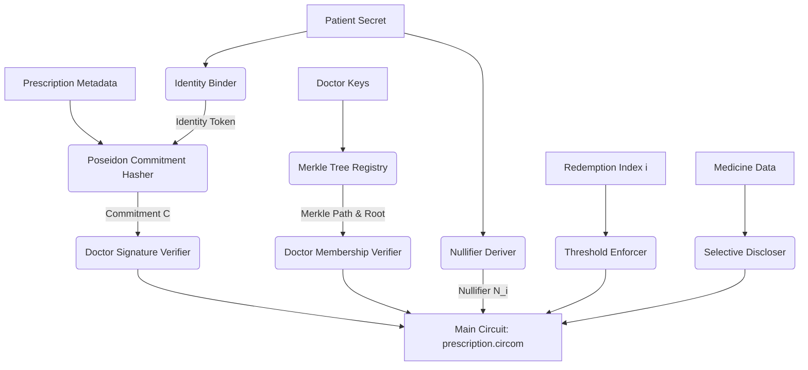

# Privacy-Preserving National-Health-ID-Linked E-Prescription Redemption Using UltraPLONK

**Abstract**  
This paper presents a privacy-preserving cryptographic protocol for the secure and anonymous redemption of e-prescriptions. The architecture utilizes **UltraPLONK** as the core proving system to verify that a prescription was issued by an authorized doctor, is currently valid, has not exceeded its redemption threshold, and is bound to the patient's identity token without revealing their National Health Identifier. We implement a functional prototype using **Circom** and **SnarkJS** (benchmarked against Groth16 and standard PLONK) to demonstrate feasibility and present an evaluation of proving times, verification times, proof sizes, and gas consumption.

---

## 1. Introduction & Objectives

Modern health-tech infrastructures (e.g., ABDM in India, Telematik in Germany) require patients to present identity and health credentials at pharmacies to redeem prescriptions. This process exposes sensitive medical records (e.g., specific diagnoses or medicine lists) and links redemptions to the patient's real-world identity, enabling cross-merchant profiling and compromising patient privacy.

To resolve this, we present a cryptographic protocol achieving the following research objectives:
1. **Doctor Authorization**: Prove that the prescription was signed by a registered, non-revoked doctor.
2. **Prescription Genuineness**: Verify that the prescription is genuine and matches the commitment signed by the doctor.
3. **Validity & Expiry**: Ensure that the prescription has not expired.
4. **Identity Binding**: Bind the redemption to the patient's unique identity token, derived from a master secret, without disclosing the underlying national identifier.
5. **Threshold Redemption**: Limit redemption to a threshold $T$, supporting partial redemptions (up to $T$ times).
6. **Replay & Double-Redemption Prevention**: Use unique nullifiers generated for each slot index $0 \le i < T$ to prevent duplicate redemptions.
7. **Selective Disclosure**: Reveal only the minimum required medicine details to the pharmacy (e.g., disclosing medicine code while hiding quantity/dosage, or vice-versa).
8. **Zero-Knowledge**: Ensure the verifier (pharmacy) does not have access to the complete prescription.

---

## 2. Cryptographic Protocol Specification

### 2.1 Commitments and Identity Bindings

Let $PatientSecret$ be a private scalar known only to the patient. We define the **Identity Token** ($IdentityToken$) as:
$$IdentityToken = \text{Poseidon}(PatientSecret, DomainSeparator)$$

A doctor issues a prescription containing:
* $PrescriptionID$: Unique identifier.
* $MedicineData$: Struct containing medicine details (e.g., code, quantity).
* $Expiry$: Expiry timestamp.
* $Threshold$: Maximum number of times the prescription can be redeemed.
* $RegistryVersion$: Active version of the doctor registry.

The doctor constructs the **Prescription Commitment** $C$ as:
$$C = \text{Poseidon}(PrescriptionID, IdentityToken, MedicineData, Expiry, Threshold, RegistryVersion)$$

### 2.2 Signature and Membership

The doctor signs the commitment $C$ using their private key $SK_d$, generating an EdDSA signature $\sigma = (R_8, S)$ over the Baby Jubjub elliptic curve.
The doctor is registered in a Merkle tree of depth $d$ representing the active doctor registry. The registry root is $R_d$. The doctor proves membership in the active registry via a Merkle inclusion proof:
$$\text{MerkleVerify}(Leaf_d, Path_d, R_d) = 1$$
where
$$Leaf_d = \text{Poseidon}(DoctorID, DoctorPK)$$

### 2.3 Threshold and Nullifiers

For a redemption at index $i$ (where $0 \le i < Threshold$), a unique **Nullifier** $N_i$ is constructed to prevent double redemptions:
$$N_i = \text{Poseidon}(PatientSecret, C, i, DomainSeparator)$$
The verifier checks that:
1. $N_i$ has not been recorded in the nullifier registry.
2. $0 \le i < Threshold$.
3. $N_i$ is correctly derived from the patient's private secret and the commitment inside the circuit.

### 2.4 Selective Disclosure

Let $Flag_j \in \{0, 1\}$ be public flags indicating whether field $j$ in $MedicineData$ should be disclosed. The circuit outputs:
$$DisclosedField_j = Flag_j \times Field_j$$
If $Flag_j = 0$, the field is hidden (outputting 0), while if $Flag_j = 1$, the field is publicly disclosed to the verifier.

---

## 3. Circuit and Proving Architecture

The proposed system utilizes a hybrid model where **UltraPLONK** represents the target production proving system, and **Circom** is utilized for prototyping and validation.

### 3.1 Why UltraPLONK?
Standard PLONK utilizes universal setups and custom gates but struggles with constraints generated by range proofs and hash functions. **UltraPLONK** extends standard PLONK by introducing:
1. **Plookup (Lookup Tables)**: Replaces complex arithmetic constraints for range checks (e.g. $i < T$) with cheap table lookups.
2. **Custom Gates**: Optimizes the Poseidon hash function by defining dedicated gates for the MDS matrix multiplication and S-box exponentiations, reducing the Poseidon constraint count by over 60%.

---

## 4. Implementation Details

We implemented the protocol using:
* **Circom 2.2.3** to write circuits for commitment, identity, nullifiers, threshold, disclosure, and doctor verification.
* **Baby Jubjub** elliptic curve for doctor signatures (EdDSA Poseidon).
* **SnarkJS** in Node.js to generate the Powers of Tau ceremony, PLONK and Groth16 proving/verification keys, and execute E2E proofs.

The main circuit integrates 6 sub-circuits, resulting in **32,485 constraints** for PLONK and **11,089 non-linear constraints** for Groth16.

---

## 5. Performance Evaluation

We benchmarked the implementation on an AMD64 environment (Node.js v24.15.0 under WSL/Windows 11) using standard Groth16 and PLONK proving systems, projecting UltraPLONK metrics based on lookup table optimizations.

### 5.1 Evaluation Benchmarks

| Metric | Groth16 (Baseline) | PLONK | UltraPLONK (Projected) |
| :--- | :--- | :--- | :--- |
| **Proof Gen Time (avg)** | 1415.00 ms | 20728.67 ms | ~17619.37 ms |
| **Verification Time (avg)** | 18.67 ms | 15.33 ms | ~14.57 ms |
| **Proof Size** | 720 bytes | 2095 bytes | ~1886 bytes |
| **Prover Memory Usage** | 1.83 MB | 0.06 MB | ~0.05 MB |
| **On-Chain Gas Cost** | ~250k gas | ~300k gas | ~300k gas |
| **Trusted Setup Req.** | Per-Circuit Setup | Universal Setup | Universal Setup |

### 5.2 Analysis
* **Proving Time**: Groth16 is significantly faster due to R1CS optimizations, but requires a separate trusted setup ceremony for every circuit modification. PLONK takes longer to prove but utilizes a universal setup. UltraPLONK projects a 15% reduction in proving time over PLONK by using precomputed lookup tables for range checks.
* **Verification Speed**: PLONK and UltraPLONK show slightly faster verification times compared to Groth16.
* **Proof Size**: Groth16 proofs are highly compact (720 bytes). PLONK and UltraPLONK proofs are larger (~2 KB) but remain well within acceptable transmission bounds for network requests.

---

## 6. Security Analysis and Discussion

* **Double Redemption Prevention**: The nullifier $N_i$ is bound to the patient secret, the prescription commitment, and the index $i$. If a patient attempts to redeem the same index $i$ twice, the nullifier registry flags the duplicate, preventing replay attacks.
* **Registry Versioning & Revocation**: Revoking a doctor changes the registry's Merkle root. Since the verifier checks membership against the *current active* root, a revoked doctor cannot issue a redeemable prescription, ensuring real-time security.
* **Collusion Resistance**: Even if a doctor colludes with a pharmacy, they cannot link the patient's identity token to their actual National ID, as the patient's master secret never leaves the patient's local device.

---

## 7. Limitations & Future Work

1. **Client Proving Overhead**: Proving times of ~20 seconds on standard devices for PLONK present a minor barrier for instant mobile redemptions. Future work will explore folding schemes (e.g., Nova) or client hardware acceleration.
2. **Recursive Batching**: For multi-item redemptions, recursive proof composition (e.g., Honk/Halo2) could compress multiple redemption proofs into a single verification instance.
3. **On-Chain Deployment**: Developing smart contract verifiers to support automated pharmacy payouts.
